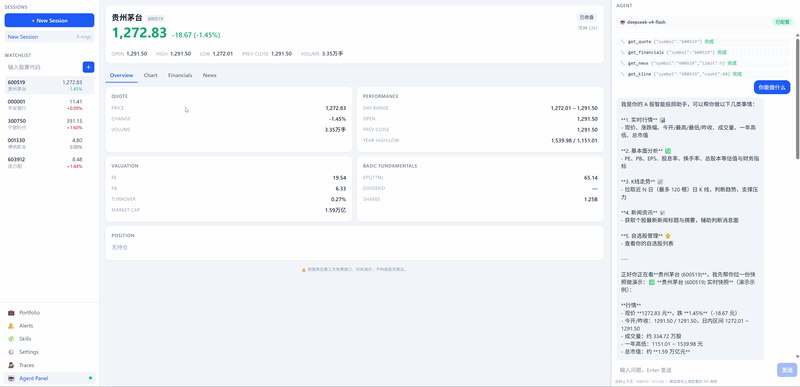
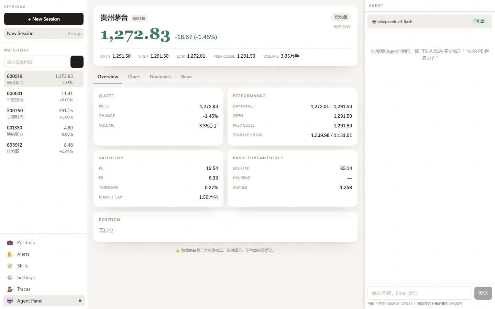
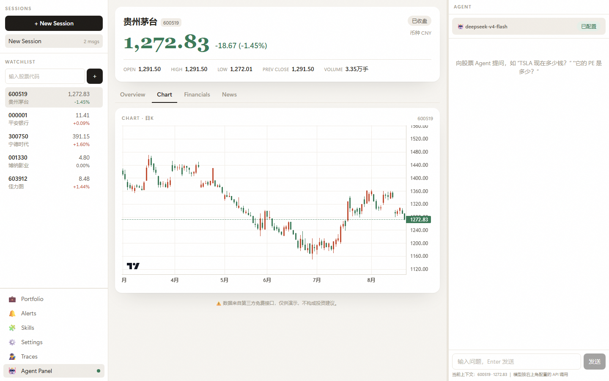
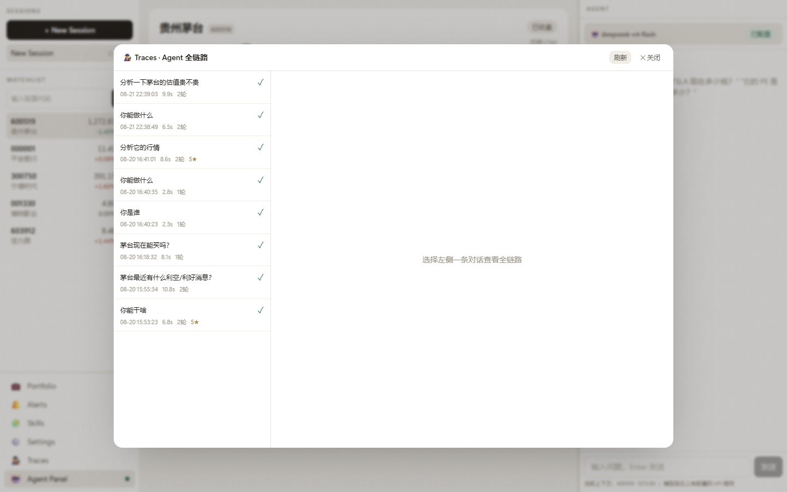
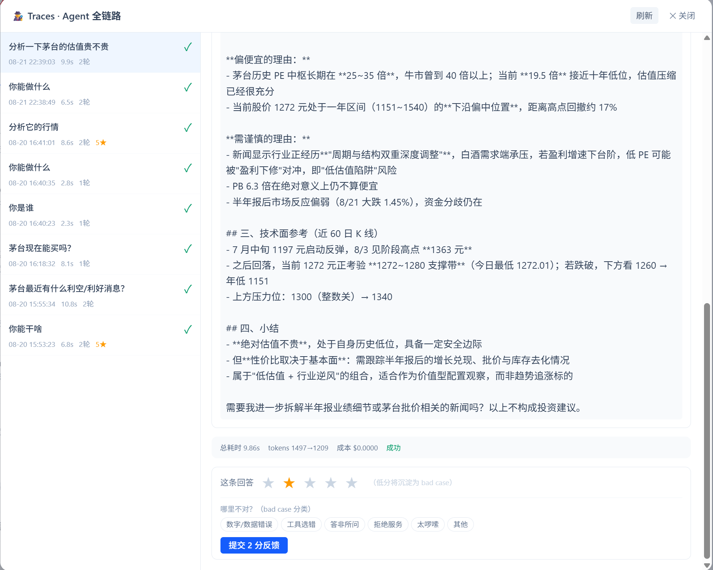

<p align="center">
  <strong>Finance Agents</strong> — 基于 Pi Agent SDK 的 A 股智能投顾工作台
  <br/>
  <em>A-share Stock Agent Workbench · PC 桌面端（仅桌面形态）· 数据源全国内，零 API Key</em>
</p>

<p align="center">
  
  
  
  
  
</p>

<p align="center">
  <strong>实时行情 + 2×2 指标卡 + K 线图表 + Agent 对话 + 全链路观测与评测闭环 + 桌面打包分发</strong>
</p>

---

## 🎬 演示

桌面版实机演示：



UI 截图（重设计版）：

| | |
|---|---|
|  |  |
|  |  |

---

## ✨ 功能特性

- **仅桌面形态**：PC 桌面应用（Electron，托盘常驻 / 单实例 / 自动更新 / 数据存 userData）；渲染层即桌面 UI，浏览器访问通道已移除，一切走本地 IPC
- **实时 A 股行情**：腾讯行情（免 key、国内可达）实时报价，新浪兜底；详情 + 自选行 10s 级自动刷新（抖动 + 指数退避 + 页面隐藏暂停）
- **股票详情面板**：头部行情（大字价格/涨跌/开高低/前收/量/交易时段徽标）+ Overview / Chart / Financials / News 四 Tab + 2×2 指标卡（QUOTE / PERFORMANCE / VALUATION / BASIC FUNDAMENTALS）+ 通栏 POSITION 卡
- **K 线图表**：腾讯前复权日 K，TradingView `lightweight-charts` 渲染（免费、无需账号）
- **Agent 对话**：Pi Agent SDK 驱动，可调工具（报价/基本面/新闻/K 线），流式输出、工具调用可见、token/cost 用量展示；**任意 OpenAI 兼容端点**（DeepSeek / 中转 / Ollama / vLLM）
- **全链路观测体系**：每次对话自动落盘 trace，UI 瀑布查看每轮模型/工具/耗时/成本；1-5★ 反馈 + 原因标签 → bad case 导出 → eval 自动吸收（详见[观测文档](docs/OBSERVABILITY.md)）
- **会话与自选**：New Session/切换/消息计数；自选增删查、选中联动详情与对话上下文；自选/会话/模型配置持久化（重启不丢，key 不入前端）

---

## 🧩 工作原理

三栏工作台，后端业务抽成传输无关 `services`（Electron 主进程与测试共用；Express 仅保留作测试面）：

```
┌──────────────┬────────────────────────────┬──────────────────┐
│SESSIONS      │Moutai 600519  SH           │Agent             │
│[+ New]       │1341.99  -0.98%  closed     │[model conf]      │
│WATCHLIST     │O 1355 H 1359 L 1338        │you: PE?          │
│600519 *      │V 2.9M  PE 20.6  PB 6.7     │tool: get_fin     │
│000001        │[QUOTE][PERF]               │asst: PE 20.6     │
│300750        │[VALUA][FUNDA]              │this turn 2k      │
│----------    │Overview|Chart|...          │[input...]        │
│Traces        │POSITION: none              │                  │
│Agent  *      │                            │                  │
└──────────────┴────────────────────────────┴──────────────────┘
         Electron 桌面（渲染层 = web UI，走 window.api(IPC)）
              └─────────────────────────────────┘
                         api.ts 单传输（IPC）
                         ▼
              server/src/services.ts（transport 无关）
       market(腾讯/新浪/东财)  agent(pi-agent-core)  traces
```

**迭代闭环（本项目差异化亮点）**：

```
对话 → trace 落盘 → UI 瀑布观测 → 1-5★反馈+原因标签
    → export:badcases 低分导出 → eval:agent 自动吸收历史 bad case
    → 指标趋势表 → 改 prompt/工具 → 对比回归（pass 涨跌/回归/改善）
```

- 数据源全部国内免费：腾讯行情（实时/日K）+ 新浪（兜底）+ 东方财富（新闻）
- 数据存 `%APPDATA%\Finance Agents`（配置/会话/报告推送设置）

---

## 🚀 快速开始

**前置**：Node.js ≥ 20（打包需要 Windows x64）。项目为**仅桌面形态**（渲染层即桌面 UI；浏览器访问通道已移除）。

### 开发
```bash
npm install
npm run dev:electron   # 桌面开发模式（自动起 vite + Electron 窗口）
```

### 打包/发布
```bash
npm run build:electron   # electron-vite build
npm run dist:win         # electron-builder → dist/ 下 Setup.exe + portable.exe
```
线上发布走 GitHub Actions：打 tag `vX.Y.Z` 自动构建并发布 Release（含自动更新）。见 [docs/PLAN_ELECTRON.md](docs/PLAN_ELECTRON.md)。

> 国内网络：自带 `.npmrc`（npmmirror + 绕代理），`npm install` 直接可用。
> 端口占用 `EADDRINUSE`（vite 5173）：先 `npm run kill:dev` 再重试。
> 打包若访问 GitHub 超时：为 electron-builder 配置代理或镜像（脚本已兼容）。

---

## ⚙️ 配置

### 模型 API（Agent 对话，可选）
右上角 Agent 面板 → `配置模型 API` → 填 baseURL / model / API key。
- 例：DeepSeek `https://api.deepseek.com/v1` + `deepseek-chat`；或 Ollama `http://localhost:11434/v1` + `qwen3:32b`
- key 只存后端内存并持久化到本地数据目录（不入前端、不提交仓库）
- **不配置也能用**：行情/图表/指标全可用，仅 Agent 对话不可用

### 数据源
**A 股数据零配置、零 key**：腾讯（实时/日K）+ 新浪（兜底）+ 东方财富（新闻）。无海外依赖。

---

## 📮 报告推送（M9）与他人部署

**每日决策仪表盘**：对"报告清单"每交易日 **20:00** 生成每股决策仪表盘，推送到飞书群。云端由 **GitHub Actions** 驱动（关机照发），配置存仓库变量+Secrets，桌面版 **Settings 面板**负责编辑与同步。

### 自己的配置（单用户，一次性）
1. 桌面版 Settings：填报告清单、报告模型、飞书 webhook、GitHub PAT、仓库（默认 `fuweiwe1/Finance_Agents`）
2. 点「**应用到云端**」→ 写入仓库变量（清单/模型）
3. 仓库 Settings → Secrets and variables → Actions，添加两个 Secret：`REPORT_MODEL_KEY`（模型 key）、`FEISHU_WEBHOOK_URL`（飞书群 webhook）
4. 之后每交易日 20:00 自动推送；也可在面板手动「发送测试卡片 / 立即正式报告」
5. 交易日历：节假日自动跳过（行情核验）；手动「立即正式报告」跳过交易日门，随时可发

### 他人 / 自建部署（一次性，约 10 分钟）
> 本功能是**单用户自部署**：云端跑的是你自己仓库里的 `daily-report.yml` 工作流。

1. **fork** 本仓库（自带报告代码 + 工作流 + 发布自动合并）
2. 安装桌面版（本地聊天/行情直接用，模型 API 自己填）
3. 桌面版 Settings 里：
   - **GitHub 仓库**改成你的 fork，如 `你的名字/Finance_Agents`
   - 填你自己的 **fine-grained PAT**（Actions/Variables/Secrets 均 Read and write）
   - 填你自己的**飞书群 webhook**、报告模型
   - **报告清单**改成你要跟踪的股票
   - 点「**应用到云端**」
4. 到**你的 fork** 的 GitHub → Settings → Secrets and variables → Actions，添加：
   - `REPORT_MODEL_KEY`（你的模型 key）
   - `FEISHU_WEBHOOK_URL`（你的飞书群 webhook，**用你自己的群**）
5. 确认 fork 的 **Actions 已启用** → 每交易日 20:00 自动推送你的飞书群

> 前提：fork + 启用 Actions（「立即生成报告」也走你 fork 的 workflow_dispatch）。文档见 [docs/DESIGN_DailyReport.md](docs/DESIGN_DailyReport.md)。

---

## 📦 常用命令

| 命令 | 说明 |
|---|---|
| `npm run dev:electron` | 桌面开发模式（Electron 窗口 + vite）|
| `npm run dist:win` | 打包 Windows 安装包 + 便携版（`electron/dist/`）|
| `npm run demo` | 数据层演示：600519/000001/300750 真实行情+财务+新闻+K线 |
| `npm run test` / `test:electron` | 单测+集成 / 桌面 E2E（独立端口，不影响开发）|
| `npm run report:*` | M9 日报：`dry` 干跑 / `card` 发测试卡 / `sync` 应用到云端 / `status` 查云端状态 |
| `npm run eval:agent` | 真实模型评测：PASS/FAIL + 对比上次 + 吸收历史 bad case |
| `npm run eval:summary` | 评测历史趋势表（只读，不调模型）|
| `npm run export:badcases` | 低分反馈 → 合并进 bad-cases.jsonl |
| `npm run kill:dev` | 清理 vite(5173) 残留进程 |

---

## ✅ 质量

- **122 项单测/集成**（腾讯/新浪解析器真实 fixture 锁字段、Agent 工具循环、trace 采集、eval 检查、service/IPC/报告路由协议）
- **Electron E2E**（窗口 + window.api IPC 全链路）+ 打包冒烟
- **真实模型评测**：`npm run eval:agent` 对 deepseek 批量重放，自动检查工具选择/数字一致/免责/回归
- typecheck / lint 全绿

---

## 🛠 技术栈

| 端 | 技术 |
|---|---|
| 桌面 | Electron 44 + electron-vite + electron-builder（NSIS + portable + 自动更新）|
| 后端 | Node.js + TypeScript + Express 5 + **Pi Agent SDK**（`pi-agent-core` / `pi-ai`）|
| 前端 | React 19 + Vite + Tailwind CSS v4 + zustand + lightweight-charts |
| 数据 | 腾讯行情 / 新浪 / 东方财富（均国内免费）|
| 测试 | Vitest + supertest + Playwright（Electron）|

---

## 🗺 路线图

- [ ] 桌面版自动更新发布到 GitHub Releases（`electron/dist/*.exe` + `latest.yml`）
- [ ] News 卡片富化（新闻列表增强、来源聚合）
- [ ] K 线多周期（周/月线 + 指标叠加）
- [ ] 持仓/自选与真实账户联动
- [ ] eval 按原因标签聚合统计、bad case 人工确认后合入用例集

---

## 📄 文档

- [观测体系与 Trace / Bad Case 迭代闭环](docs/OBSERVABILITY.md)
- [Electron 桌面端改造计划](docs/PLAN_ELECTRON.md)
- [实施计划](docs/PLAN.md)

---

## ⚠️ 免责声明

本项目为技术演示，数据来自第三方免费接口，**仅供参考，不构成任何投资建议**。股市有风险，投资需谨慎。

## 📜 致谢

- [Pi Agent Harness](https://github.com/earendil-works/pi) — `pi-agent-core` / `pi-ai` Agent 运行时与多模型接入
- [Electron](https://www.electronjs.org/) / [electron-vite](https://electron-vite.org/) — 桌面端
- [lightweight-charts](https://github.com/tradingview/lightweight-charts) — TradingView 开源图表
- 腾讯行情 / 新浪财经 / 东方财富 — A 股数据源

## 📃 License

MIT